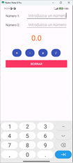
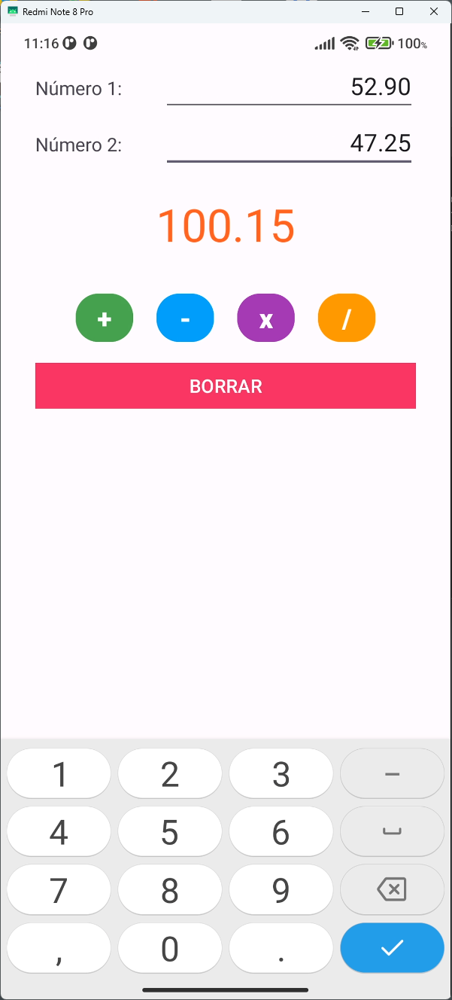

# Supermini Calculadora

Esta es una app Android sencilla que permite realizar operaciones básicas entre dos números.

## 📱 Interfaz de Usuario (UI)

- **Padding general:** Todos los componentes están a 30dp hacia el interior.
- **Número 1 y Número 2:**
    - `TextView` con texto "Número 1:" y "Número 2:" respectivamente.
    - `EditText` asociado a cada uno:
        - Hint: "Introduzca un número".
        - Alineado a la derecha.
        - Acepta números con decimales y signo.
        - Inicialmente vacío.
- **Resultado:**
    - `TextView` con texto por defecto "0.0".
    - Tamaño de fuente mayor, color naranja, contenido centrado.
- **Botones de operación:**
    - Cada `Button` tendrá un color de fondo diferente.
    - Botones con texto "+", "-", "x", "/" respectivamente.
    - Fuente tamaño 20, estilo negrita.
    - Esquinas redondeadas.
- **Botón BORRAR:**
    - `Button` con texto "BORRAR".
    - Tamaño completo.
    - Color de fondo rojo, esquinas rectas.

## ⚙️ Funcionalidad

- Cada botón realiza su operación si ambos campos numéricos son válidos. Si no, se muestra "Error" en el resultado.
- Botones de operación:
    1. **[ + ]** Suma los dos números.
    2. **[ - ]** Resta el segundo número al primero.
    3. **[ x ]** Multiplica ambos números.
    4. **[ / ]** Divide el primer número entre el segundo.
- El botón **[BORRAR]** limpia los dos campos de entrada y reinicia el resultado a "0.0".

## 🛠️ Tecnologías usadas

- Android Studio
- Java
- XML (para layouts)
- API mínima: 28+ (Android 8.1)

## 📂 Estructura del proyecto

```
/app/src/main/java/.../MainActivity.java (funcionalidad básica)
/app/src/main/java/.../MainActivityV2.java (refactorización de código, incluye validación de campos con Pair)
/app/src/main/java/.../MainActivityV3.java (refactorización de código, centralización de código único método operacinal)
/app/src/main/res/layout/activity_main.xml
```

## 📸 Capturas de pantalla

### Pantalla principal



### Resultado de una operación



### Error en la operación


## 📄 Licencia

Este proyecto es de uso educativo y puede modificarse libremente.